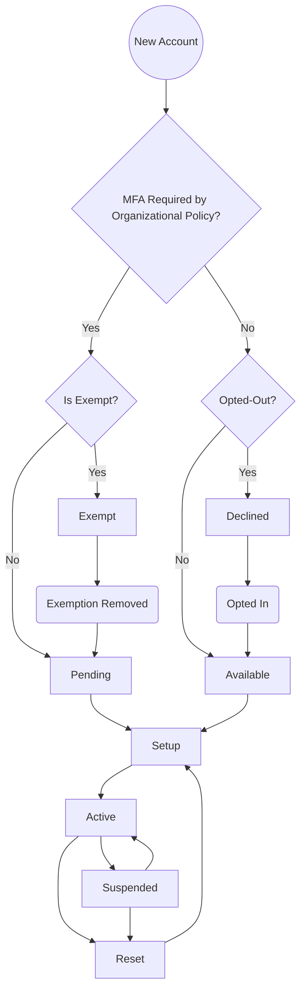

# voPerson MFA

* [Introduction](#introduction)
* [Participants](#participants-and-behaviors)
* [Typical State Flow](#typical-state-flow)
---
# Introduction

This document provides additional context for considerations around use of the
`voPersonMfaStatus` attribute. This document is not normative.

`voPersonMfaStatus` is largely intended as an intra-organizational state
attribute, designed to allow multiple components within an Identity Management
System (IdMS) to coordinate MFA related actions for a particular subject. Usage in a
federated context is expected to be limited to those situations where multiple
organizations need to coordinate actions based on the configuration state of a
subject's MFA tokens, not the real time aspects of whether the subject has performed
authentication using them.

For real time signaling see the [REFEDS MFA Profile](https://refeds.org/profile/mfa).

# Participants and Behaviors

Within an organizational Identity Management System, the person to whom an MFA
token is to be issued is referred to as the **Subject**. The Subject typically
engages with the **Credential Service Provider (CSP)** to establist their local
_subscriber account_. The CSP may consist of several components, including an
_Identity Registry_ that maintains the authoritative record of enrolled Subjects,
and an _Authenticator Issuance Service_ that generates the actual MFA tokens.

When a new Subject is presented to the Identity Registry, the initial
`voPresonMfaStatus` should be set to a base state reflecting the default
policy of the organization, typically `available` or `pending`. If during
this process the Subject is granted a policy exemption or declines to
participate in MFA, `voPersonMfaStatus` should be set to an appropriate
value, such as `exempt` or `declined`.

After the initial state creation, there may be local procedures that must
be completed prior to the issuance of an MFA token, such as vetting or
approval. When the Subject is ready to start the MFA credentialling process,
the IdMS may signal this state to the Authenticator Issuance Service by
setting `voPersonMfaStatus` to `setup`. Once the MFA token has been issued,
the `voPersonMfaStatus` should be set to `active`. 

Subsequent changes to `voPersonMfaStatus` are driven by account lifecycle
changes, typically involving helpdesk actions or self service utilities.
Most commonly, `voPersonMfaStatus` would flip amongst `reset`, `suspended`,
and `active` in accordance with real world events.

The organizational Identity Provider (IdP) may decide whether to require
MFA or to take some other action in accordance with the `voPersonMfaStatus`
and the organization's policies. For example:

<table>
  <tr>
    <th>voPersonMfaStatus</th>
    <th>Policy Requires MFA</th>
    <th>Policy Does Not Require MFA<th>
  </tr>

  <tr>
    <td>active</td>
    <td>MFA</td>
    <td>MFA</td>
  </tr>

  <tr>
    <td>available</td>
    <td>Error</td>
    <td>SFA</td>
  </tr>

  <tr>
    <td>declined</td>
    <td>Error</td>
    <td>SFA</td>
  </tr>

  <tr>
    <td>exempt</td>
    <td>SFA</td>
    <td>SFA</td>
  </tr>

  <tr>
    <td>pending</td>
    <td>Fail</td>
    <td>Error</td>
  </tr>

  <tr>
    <td>reset</td>
    <td>Fail</td>
    <td>SFA</td>
  </tr>

  <tr>
    <td>setup</td>
    <td>Fail</td>
    <td>SFA</td>
  </tr>

  <tr>
    <td>suspended</td>
    <td>Fail</td>
    <td>SFA</td>
  </tr>
</table>

These policies could vary on a per-SP basis if appropriate, or even a
per-IdP basis (if a given organization runs more than one IdP).

# Typical State Flow

The following flow diagram describes the expected state changes for this
attribute in a typical deployment.

